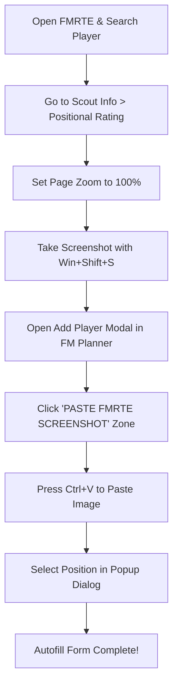

# ⚽ FM Planner - Football Manager Squad & Tactic Builder

<div align="center">
  
  
  <h3>Premium Desktop Assistant for Football Manager Tactic Planning & Squad Management</h3>

  [](https://electronjs.org/)
  [](https://nodejs.org/)
  [](https://sqlite.org/)
  [](https://github.com/naptha/tesseract.js)
  [](https://python.org/)
  [](https://www.fmrte.com/)
  [](https://www.fmscout.com/)
</div>

---


---

---

## 📖 About the Application

**FM Planner** is a personal project created specifically to meet my personal needs for tracking role/position scoring weights in **Football Manager (FM)**. 

I usually use this tool in combination with external utilities like **FMRTE (Football Manager Real Time Editor)** or **FM Genie Scout**. These tools are used to calculate and generate positional suitability values (*Scoring*), which I then save here in FM Planner as a centralized, easily analysable tactical planning database.

---

## ⚡ Key Features & Page-by-Page Guide

Each page is custom-built with a responsive, modern **Vibrant Slate Premium** theme, interactive controls, and smooth micro-animations:

### 1. 📋 Tactical Pitch & Squad Depth Dashboard (`index.ejs`)
The central command hub for your team planning:
* **Interactive Pitch Map (3D Style)**: A modern visual football pitch with glowing neon green lines. Drag-and-drop players directly into tactical slots.
* **Undo & Redo Action History**: Experiment with tactics without worry. Reverse or repeat your position changes using the Undo/Redo toolbar controls.
* **Smart Average Tracker & Warning**: The system automatically calculates your starting squad's average rating, triggering a blinking red alert if your squad strength declines significantly.
* **Theme Mode Switcher**: Instantly toggle between **Premium Dark Mode** and **Slate Light Mode** with consistent input contrast and harmonious borders.

### 2. 🎓 Academy Development (`academy.ejs`)
Specifically designed to monitor your club's wonderkids and youth prospects:
* **Academy Statistics Banner**: Displays total youth players, average academy rating, and the count of high-potential talents.
* **U-21 & U-18 Separation**: Automatically separates youth players into Under-21 and Under-18 tables to easily monitor match eligibility.
* **Dynamic Nationality Autocomplete**: A typo-tolerant search input featuring dynamic SVG country flags.

### 3. 🎯 Shortlist & Targets (`shortlist.ejs`)
Your transfer draft board:
* **Progress Bars for Rating & Potential**: Graphically represents a player's current rating vs. their future potential.
* **Sign Player Shortcut**: Instantly promote or sign a player from the shortlist to the main active squad with a single click.

### 4. 💰 Sales Planner (`sell.ejs`)
Plan squad departures and project financial income:
* **Estimated Revenue Calculator**: Automatically sums up projected transfer/loan income from listed players.

### 5. 🏆 Trophy Room (`trophies.ejs`)
Showcase your club's historical silverware and runner-up archives.

---

## 🧠 Smart Behind-the-Scenes Features

Optimizations tailored for a premium user experience:

1. **Smart Duplicate Name Protection**
   The local database intelligently handles character accents and diacritics. A name with special characters (e.g., *Ertuğrul Kurtuluş*) and its standard version (*Ertugrul Kurtulus*) are recognized as the **same player**. The system rejects the new entry, preserves the older record, and displays a red notification toast.
2. **Global Keyboard Shortcuts**
   - Press **`Enter`** inside any modal input fields to automatically save the form (preventing browser defaults that might trigger unintended deletes).
   - The keydown listener respects the nationality search dropdown, letting you press `Enter` to highlight and select countries before submitting the player.
3. **Harmonious Light Mode Overrides**
   The light theme features carefully tailored styling for modals, dropdowns, registration badges, position grids, rating history tables, and the OCR paste zone, ensuring highly readable slate text and consistent slate borders.

---

## 📷 How to Use the AI OCR Clipboard Reader

The OCR feature is currently designed to perform **Instant Imports from FMRTE only**.



* **Step 1**: In the **FMRTE** app, navigate to the player's profile and go to the **`Scout Information`** > **`Positional Rating`** tab.
* **Step 2**: Ensure the page is fully zoomed in (set the FMRTE zoom level to **100%**).
* **Step 3**: Capture a screenshot of this page using the Windows shortcut: **`Win + Shift + S`**.
* **Step 4**: Open the **FM Planner** app and click the add player button to open the **Add Player** modal.
* **Step 5**: Click the green dashed zone labelled **`PASTE FMRTE SCREENSHOT`** at the top of the form, then press **`Ctrl + V`**.
* **Step 6**: A dialog will pop up showing the positions detected by the parser. Choose a position to instantly populate Name, Age, Nationality, Rating, and Potential in the form.

---

## ⚙️ How to Run & Build the EXE Installer

The application can be run directly using Node.js or compiled into a single self-contained Windows setup installer `.exe`.

### A. Quick Start for Users (Portable ZIP Version)
If you downloaded the portable ZIP version of the application:
1. **Download the ZIP** archive containing the compiled build.
2. **Extract the ZIP** contents to any folder on your computer.
3. Open the folder and double-click **`FM Planner.exe`** to launch the application instantly (no installation or database setup required).

### B. System Prerequisites (For Developers & Builders)
* **Node.js** (Version 16 or newer)
* **Python** (Version 3.8 or newer, required only for building the setup installer)

### C. Developer Installation Steps
1. Open your terminal in the root folder `fm-planner` and install main dependencies:
   ```bash
   npm install
   ```
2. Move to the Express backend subfolder and install server-specific modules:
   ```bash
   cd resources/app
   npm install
   ```
3. Return to the root folder and run the developer build:
   ```bash
   cd ../..
   npm start
   ```
