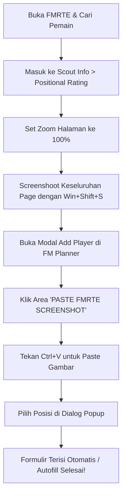

# ⚽ FM Planner - Football Manager Squad & Tactic Builder

<div align="center">
  
  
  <h3>Asisten Desktop Premium untuk Perencanaan Taktik & Manajemen Skuad Football Manager</h3>

  [](https://electronjs.org/)
  [](https://nodejs.org/)
  [](https://sqlite.org/)
  [](https://github.com/naptha/tesseract.js)
  [](https://python.org/)
</div>

---

## 📖 Tentang Aplikasi

**FM Planner** adalah proyek pribadi yang dibuat khusus untuk memenuhi kebutuhan personal saya terhadap perhitungan bobot skor peran/posisi (*role/positions scoring weight*) pada game **Football Manager (FM)**. 

Alat ini biasa saya gunakan bersamaan dengan external tools seperti **FMRTE (Football Manager Real Time Editor)** atau **FM Genie Scout**. Kedua tools tersebut digunakan untuk menghasilkan nilai kalkulasi kecocokan posisi (*Scoring*), lalu saya menyimpannya di FM Planner ini sebagai basis data perencanaan taktis jangka panjang secara terpusat dan mudah dianalisis.

---


## ⚡ Fitur Utama & Panduan Per Halaman

Setiap halaman di rancang khusus dengan antarmuka dinamis dan micro-animation responsif:

### 1. 📋 Dashboard Lapangan & Skuad (`index.ejs`)
Merupakan pusat komando taktis tim Anda:
* **Interactive Pitch Map (3D Style)**: Representasi visual lapangan sepak bola modern dengan garis batas neon hijau bercahaya. Tarik dan taruh (*drag-and-drop*) pemain langsung ke posisi terbaik.
* **Undo & Redo History**: Lakukan eksperimen taktik tanpa rasa khawatir. Navigasikan perubahan posisi Anda menggunakan tombol Undo/Redo di toolbar.
* **Smart Average Tracker & Warning**: Sistem menghitung rata-rata rating tim utama dan memberikan efek kedip merah (*warning alert*) jika rata-rata performa skuad menurun drastis.
* **Theme Mode Switcher**: Beralih instan antara **Premium Dark Mode** dan **Slate Light Mode** dengan pencahayaan dan kontras input yang selaras secara visual.

### 2. 🎓 Akademi Pemain Muda (`academy.ejs`)
Pusat pembinaan bakat masa depan klub Anda:
* **Statistik Akademi**: Banner informasi pintar yang merangkum jumlah talenta muda di tim U-21 & U-18 serta performa potensial rata-rata mereka.
* **Pemisahan Kelompok Umur**: Pemisahan otomatis antartabel U-21 dan U-18 untuk memudahkan pemantauan kelayakan bermain.
* **Autocomplete Kebangsaan Dinamis**: Input pencarian negara yang *typo-tolerant*, dilengkapi bendera negara SVG dinamis dan auto-detect input.

### 3. 🎯 Shortlist Target Transfer (`shortlist.ejs`)
Papan rencana belanja pemain Anda:
* **Progress Bar Rating & Potensi**: Menampilkan grafik visual kekuatan performa saat ini (*current rating*) vs performa masa depan (*potential*).
* **Sign Player Shortcut**: Rekrut instan pemain dari daftar pantau (*shortlist*) langsung ke skuad utama dengan menekan tombol **Sign**.

### 4. 💰 Proyeksi Penjualan (`sell.ejs`)
Perencana finansial pelepasan pemain:
* **Estimasi Pendapatan**: Kalkulator otomatis yang menjumlahkan proyeksi dana transfer masuk dari seluruh pemain yang masuk daftar jual (*transfer/loan listed*).

### 5. 🏆 Trophy Room (`trophies.ejs`)
Lemari piala digital untuk mendokumentasikan kejayaan klub dari masa ke masa.

---

## 🧠 Fitur Cerdas Tambahan (Smart Features)

Aplikasi ini dilengkapi optimasi canggih di balik layar untuk menghadirkan pengalaman pengguna terbaik:

1. **Proteksi Duplikasi Nama Pintar**
   Database mendeteksi nama pemain secara cerdas. Nama dengan karakter khusus/diakritik (misal: *Ertuğrul Kurtuluş*) dan versi tanpa karakter khusus (*Ertugrul Kurtulus*) dibaca sebagai **pemain yang sama**. Sistem akan menolak duplikasi entry baru dan mempertahankan data terlama.
2. **Global Keyboard Shortcut**
   - Tekan **`Enter`** saat mengisi formulir di modal manapun untuk menyimpan data secara otomatis (menggantikan behavior default browser yang kadang memicu tombol hapus/delete).
   - Menghormati dropdown kebangsaan, sehingga `Enter` tetap berfungsi memilih opsi negara terlebih dahulu sebelum melakukan submit formulir.
3. **Harmonisasi Light Mode Premium**
   Desain visual mode terang (light mode) yang disempurnakan. Seluruh input teks, selector dropdown, tombol posisi, tag registrasi, tabel riwayat, dan area OCR disesuaikan agar kontras warna selaras, elegan, dan nyaman di mata.

---

## 📷 Cara Menggunakan AI OCR Clipboard Reader

Fitur OCR saat ini berfungsi secara khusus untuk melakukan **Instant Import data dari tools FMRTE saja**. 



* **Langkah 1**: Di aplikasi **FMRTE**, buka profil pemain pilihan Anda, lalu masuk ke tab **`Scout Information`** > **`Positional Rating`**.
* **Langkah 2**: Pastikan tampilan halaman tersebut sangat ngezoom atau diatur ke tingkat perbesaran **100%**.
* **Langkah 3**: Ambil tangkapan layar (screenshot) keseluruhan halaman tersebut menggunakan shortcut Windows: **`Win + Shift + S`**.
* **Langkah 4**: Buka aplikasi **FM Planner**, lalu klik tombol tambah pemain untuk membuka tab **Add Player**.
* **Langkah 5**: Klik area bertuliskan **`PASTE FMRTE SCREENSHOT`** di bagian atas modal (berwarna hijau putus-putus), lalu tekan **`Ctrl + V`**.
* **Langkah 6**: Kotak dialog akan muncul menampilkan pilihan posisi terdeteksi lengkap dengan nilainya. Pilih posisi yang sesuai untuk mengisi seluruh formulir secara otomatis.


---

## ⚙️ Cara Menjalankan & Membangun Installer EXE

### A. Cara Cepat untuk Pengguna (Versi Portable)
Jika Anda mengunduh aplikasi ini dalam bentuk berkas ZIP:
1. **Unduh berkas ZIP** rilis aplikasi FM Planner.
2. **Ekstrak berkas ZIP** tersebut ke dalam folder pilihan Anda di komputer.
3. Buka folder ekstraksi dan cukup klik ganda **`FM Planner.exe`** untuk langsung menjalankan aplikasi secara portable (tanpa perlu instalasi tambahan).

### B. Persyaratan Sistem (Untuk Developer & Builder)
* **Node.js** (Versi 16 atau lebih baru)
* **Python** (Versi 3.8 atau lebih baru, untuk mengompilasi Installer)

### C. Langkah Instalasi Developer

1. Buka terminal/cmd di folder root `fm-planner` lalu unduh dependensi:
   ```bash
   npm install
   ```
2. Masuk ke subfolder backend Express dan instal modul servernya:
   ```bash
   cd resources/app
   npm install
   ```
3. Kembali ke folder root dan jalankan aplikasi:
   ```bash
   cd ../..
   npm start
   ```
